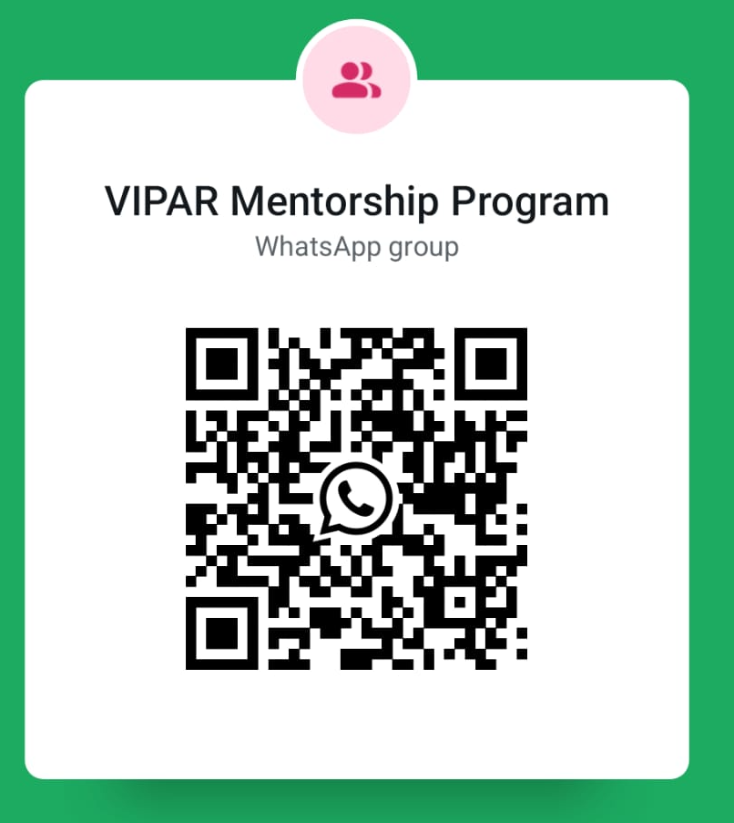

# 🎓 Practical Data Science & Algorithms Workshop

Welcome to the **Practical Data Science & Algorithms Workshop** repository. This workspace contains Jupyter Notebooks, Python scripts, slide decks, and assessments designed to walk you through core concepts in data science, statistics, algorithms, and code optimization.

---

  

  
  
  

  
  
  
  
  

---

## 🔗 Important Links

| No. | Quick Links |
| :--- | :--- |
| **1**  | 🗳️ [Gumball Estimation](https://forms.gle/fanYuH7cXLiWKcMn6) |
| **2**  | ✍️ [Aptitude Quiz](https://forms.gle/wv4TM43ULXoLwWp98) |
| **99**  | 📝 [Questions Feedback and Suggestions](https://forms.gle/jDdqouHVhc5Jt1Bc6) |
<!--| **3**  | 💻 [Python Code Review - Code Submission](https://forms.gle/MhTBiPA47z9oYTt27) |
| **4**  | 💾 [Python Hackathon - Code Submission](https://forms.gle/6J58xhTga35Gvp2o9) |
| **5**  | 💰 [Financial Literacy](https://forms.gle/oHaMNQBJYxudL3bY9) |-->

<!--| **100**  | 🎓 [End of Program Feedback](https://forms.gle/APrDzJwyrXhmN7rb9) |-->

## 📞 Connect with Us

| How | Links |
| :--- | :--- |
| Scan to join our WhatsApp Mailing List  |  |
| Call or message us @  | 9500712432 |
